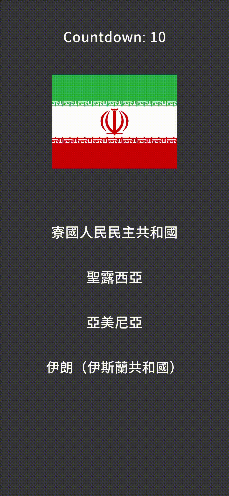
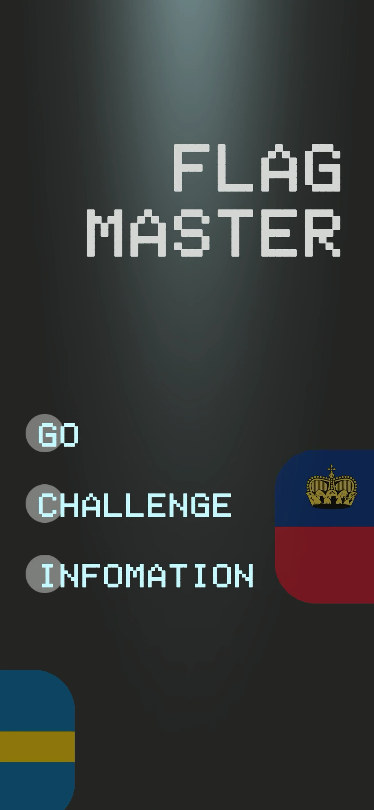
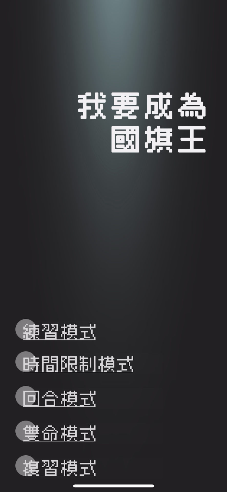
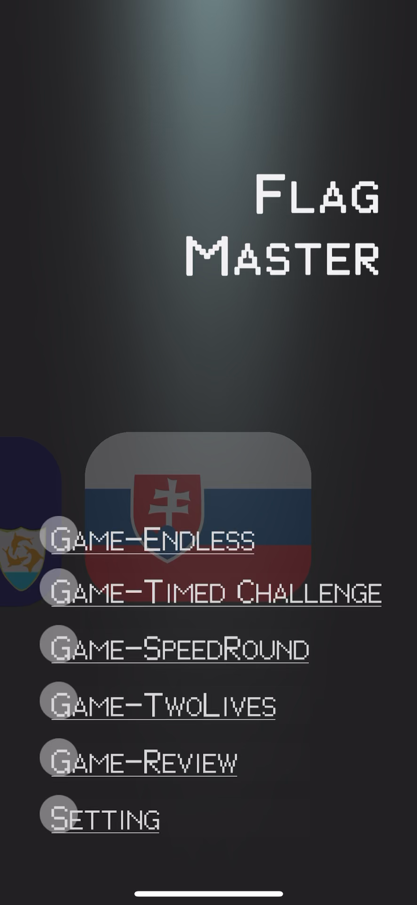
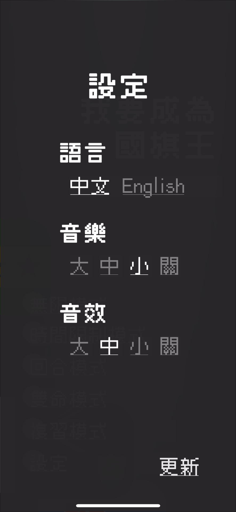
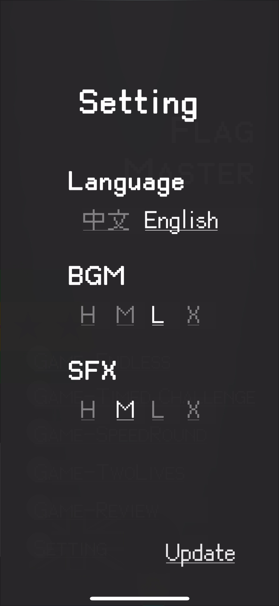

# FlagMaster

## Introduction

This is a simple flag guessing game. Each round, four countries are randomly selected from a list and displayed on the screen. The player needs to choose the correct country name based on the displayed flag.

### V1
1.	Random Country Selection: Randomly selects four countries from the country list, with only one being the correct answer.
2.	Display Country Names: Country names are displayed on four buttons, allowing the player to make a selection.
3.	Answer Validation: After a selection is made, the correct answer is shown in green if the player is correct. If incorrect, the correct answer is shown in green and the wrong answer in red.
4.	Automatic Next Question: Whether the answer is correct or incorrect, the system automatically moves to the next question after a 2-second delay.

### V2

In this version, several visual effects have been added to enhance the gameplay experience.

Visual Enhancements:

1. Countdown Flicker: The countdown timer now flickers during the last three seconds, adding a sense of urgency.
2. Rounded Corners for Flag: The flag image now has rounded corners for a more polished appearance.
3. Elliptical Country Buttons: The country buttons are displayed in an elliptical shape to improve visual appeal.
4. Display Effects: Visual effects are added when the country names and flag are displayed, making the game more dynamic.

### V3

1. Sound and Audio Effects:
    * Added background music (BGM) and various sound effects (SFX) to enhance the gaming experience.
    * The sound effects include cues for correct answers and alerts for incorrect answers, allowing players to instantly perceive their choices.
2. Scene Transition Effects:
    * Smooth visual transition effects have been added between different scenes, using Fade In and Fade Out to enhance the scene switch experience.
3. First Edition of Full Gameplay Experience:
    * Complete gameplay experience, including quiz flow, countdown timer, and real-time feedback on correct and incorrect answers.
    * Players can review their mistakes after answering questions, providing an opportunity to revisit wrong answers.
4. Pause Feature:
    * Players can pause the game at any time and choose from the pause menu to continue the game, restart, or return to the main menu.
    * The pause menu slides in when activated and smoothly transitions back when actions are selected.
5. Visual Effects:
    * Added multiple visual effects to the game, such as button pulsating, background animations, etc., making the game screen more dynamic and visually engaging.
 

### V4
1.	Support for More Game Modes:
    * Endless Mode: Infinite question mode.
    * Timed Challenge Mode: A challenge mode with a time limit, testing how many questions can be answered in a limited time.
    * Speed Round Mode: Fast reaction mode where each question has a short time limit.
    * Two Lives Mode: Players have two chances to answer incorrectly before the game ends.
    * Review Mode: Review the 50 countries with the lowest accuracy to focus on frequently missed questions.
2.	Redesigned UI/UX:
    * Modern and simplified design for a better user experience and improved visuals.
3.	Bug Fix:
    * Addressed a known issue to improve game stability and performance.

### V5
1.	Added Language Switching Feature: Users can now switch the app’s display language between Chinese (Traditional) and English through the settings panel. The language preference is automatically saved and will be applied the next time the app is opened.
2.	Music and Sound Effect Settings: Added functionality to adjust the music volume and sound effect volume. Users can select from four volume levels: High, Medium, Low, and Off. These settings are saved and will be restored when the app is reopened.
3.	UI Animation Enhancements: Panels such as the settings panel now have fade in/out and slide in/out animations, improving the user experience with smoother transitions.
4.	Button Feedback Sound Effects: A sound effect is now triggered when a button is pressed, providing richer feedback during user interaction.
5.	Localization Optimization: The app dynamically switches the localized text using LocalizationSettings. All UI texts update in real-time when switching between languages.

    
    
    

